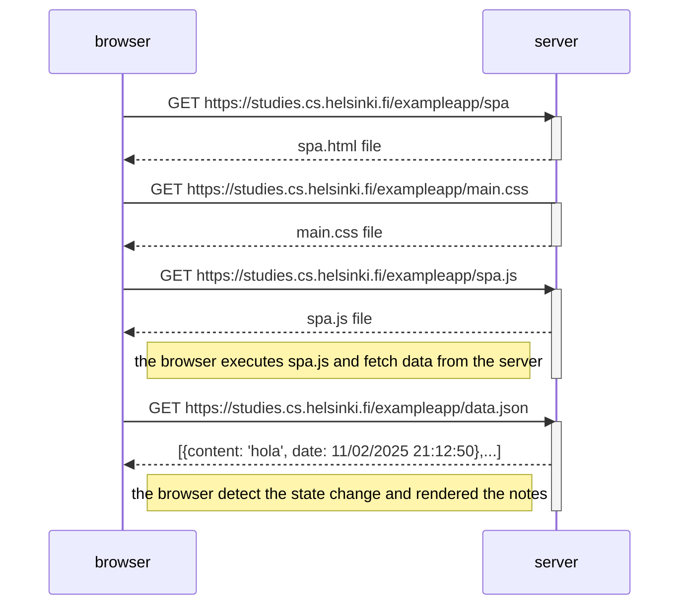

```mermaid 
sequenceDiagram
    participant browser
    participant server
    browser ->> server: GET  https://studies.cs.helsinki.fi/exampleapp/spa
    
    activate server
    server -->> browser: spa.html file
    deactivate server

    browser -> server: GET https://studies.cs.helsinki.fi/exampleapp/main.css

    activate server
    server -->> browser: main.css file
    deactivate server

    browser ->> server: GET https://studies.cs.helsinki.fi/exampleapp/spa.js

    activate server
    server -->> browser: spa.js file
    Note right of browser: the browser executes spa.js and fetch data from the server 
    deactivate server

    browser ->> server: GET https://studies.cs.helsinki.fi/exampleapp/data.json
     
    activate server
    server -->> browser: [{content: 'hola', date: 11/02/2025 21:12:50},...]
    Note right of browser: the browser detect the state change and rendered the notes
    deactivate server
```