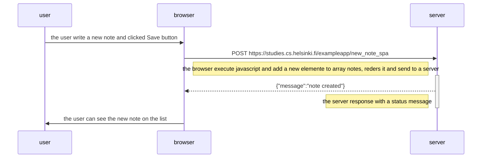

```mermaid
sequenceDiagram
    participant user
    participant browser
    participant server

    user ->> browser: the user write a new note and clicked Save button
    browser ->> server: POST https://studies.cs.helsinki.fi/exampleapp/new_note_spa
    Note right of browser: the browser execute javascript and add a new elemente to array notes, reders it and send to a server

    
    activate server
    server -->> browser: {"message":"note created"}
    Note left of server: the server response with a status message
    deactivate server

    browser ->> user: the user can see the new note on the list
```